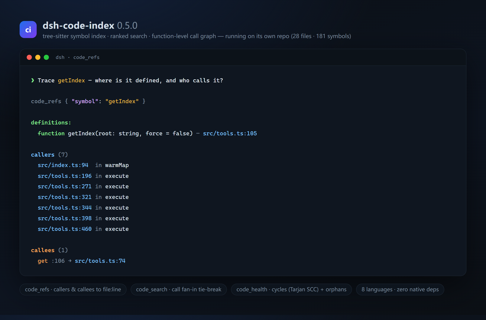

# dsh-code-index

[](https://www.npmjs.com/package/dsh-code-index)
[](https://github.com/lemonxiny55/dsh-code-index/actions)

English | [中文](README.zh.md)

Structural context engine for [DeepSeek Harness](https://github.com/deepseek-ai/deepseek-harness) (`dsh`): a local, no-service, no-API-key tree-sitter index that gives agents the smallest useful structural context for the task at hand.

Fits a niche the ecosystem took a while to fill: alongside git/voice/browser/memory plugins, several code-intelligence plugins have appeared (graph-based, embedding-based), while this one stays deliberately **dependency-free** — pure in-process tree-sitter over WASM, the aider repo-map / Cursor `@Codebase` style for dsh agents.

## What the model gets

| Tool | Purpose |
|---|---|
| `code_index` | Status / (re)build the index for the current workspace |
| `code_symbols` | List symbols (functions, classes, interfaces, types, methods…) with file:line — filtered by name, path, kind, exported |
| `code_search` | Ranked lookup: exact > prefix > substring > subsequence-fuzzy, exports first, relevance score + file:line |
| `code_map` | Bounded ranked repo map (top files by symbol density + import-graph PageRank, key symbols + lines) |
| `code_refs` | Trace a symbol through the call graph: callers (who calls it) and callees (what it calls), resolved to file:line |
| `code_change_context` | Start from the working-tree or an explicit diff and return changed symbols, callers, import dependents, bounded impact paths, and likely tests |
| `code_context` | Task-aware unified entry point: routes a plain-language task across search, repo map, call/import graph, change context, tests, and a hard character budget |
| `code_health` | Opt-in (`codeHealth: true`): circular dependencies (import cycles) and orphan modules |

Plus an optional **auto-injected system prompt section** (`code-index:repo-map`, order 60): a compact ranked map of the default workspace, refreshed on a TTL (`mapTtlMs`, default 60s). Set `autoInject: false` to disable and rely on the `code_map` tool only.

## Install

Requires `dsh` (any install path — npx, npm, or source) and Node ≥ 22.

```sh
# from npm (prebuilt)
npx @deepseek-ai/dsh plugin --profile web add dsh-code-index

# or from a directory containing this checkout
npx @deepseek-ai/dsh plugin --profile web add ./dsh-code-index
```

Restart the Web UI (`npx @deepseek-ai/dsh web`) — startup logs confirm each tool:

```
[dsh-code-index] plugin loaded
[dsh-code-index] registered tool: code_index
...
```

Verify the composed config without booting: `dsh --profile web --dump-config`.

## Using it

In a workspace session, ask the agent:

- "Which repo are we in — run code_map first."
- "Find every function whose name contains `parse` and where it lives."
- "List the exported symbols in src/core."
- "Rebuild the code index."
- "What changed in the working tree, who calls it, and which tests are likely affected?"
- "Fix duplicate configuration loading during startup." (the router selects the smallest useful context automatically)

No API key is needed to *index*; the model must of course be configured to call the tools.

## Example (input → output)

User prompt:

> Which repo are we in? Run `code_map` first, then find where `extractSymbols` is defined.

The agent calls the tools in turn:

```
code_map
# repo map
## src/extract.ts (14)
  function extractSymbols(code, id) :121
  function languageForFile(filePath) :37
  ...

code_search { query: "extractSymbols" }
export function extractSymbols(code, id) — src/extract.ts:121
```

The index builds lazily on first use; later calls are served from the on-disk cache with mtime-incremental refresh.

### Call graph

`code_refs` traces a symbol through the call graph — the run below is on this repo itself (`getIndex` is defined at `src/tools.ts:105`, called from 7 sites, and its callee resolves to `src/tools.ts:74`):



### Change-aware context

`code_change_context` defaults to the current Git working tree against `HEAD`. It also accepts an inline unified diff, repo-relative `files`, or stable `symbols` IDs. Results are bounded and each inferred relationship carries a provenance label: `exact`, `import-scoped`, or `name-only`. Deletions and renames use the baseline ref when available; untracked non-ignored files are included in working-tree mode.

### Task-aware context

`code_context` is the high-level entry point for agents that have a task rather than a symbol query. The deterministic router recognizes change, symbol, architecture, test, exploration, and ambiguous tasks, then ranks existing primitives into one bounded package:

```text
code_context { task: "Fix duplicate configuration loading during startup" }

Task context — change
Primary symbols:
- [exact] function loadConfig() — src/config.ts:42
Relevant files:
- src/config.ts (current change)
- src/bootstrap.ts (entry path)
Relationships:
- bootstrap → loadConfig at src/bootstrap.ts:18 [exact; explicit-import-binding]
Current changes:
- modified function loadConfig() src/config.ts:42 [exact]
Likely affected tests:
- tests/config.spec.ts
Budget: 3720 / 5000 chars
```

The `budgetChars`, `maxFiles`, and `maxSymbols` arguments are optional. `code_context` does not call an external model or API; `exact`, `import-scoped`, and `name-only` provenance remains explicit for inferred relationships.

## Configuration

Options are passed as the plugin row's `config` in the profile patch (or defaults are used if absent):

```yaml
# $DSH_HOME/profiles/<name>/cordis.patch.yml — a bare row overrides by id.
- id: code-index
  config:
    excludeDirs: [generated, playground]
    mapTopFiles: 30
    mapMaxChars: 4000
    autoInject: true
    toolSurface: full
```

| Key | Default | Meaning |
|---|---|---|
| `excludeDirs` | `[]` | Extra dirs appended to the built-in excludes (`node_modules`, `.git`, `dist`, `build`, `out`, `coverage`, `.next`, `.nuxt`, `.cache`, `target`, `vendor`, …) |
| `mapTopFiles` | `24` | Max files in a ranked map |
| `mapMaxChars` | `3200` | Hard cap on rendered map characters |
| `mapTtlMs` | `60000` | Refresh interval for the auto-injected map (ms, min 1000) |
| `autoInject` | `true` | Register the system prompt section |
| `codeHealth` | `false` | Register the `code_health` tool (cycles / orphan modules) |
| `toolSurface` | `full` | Experimental `compact` mode exposes `code_index`, `code_context`, and enabled `code_health`; `full` preserves all tools |

## Supported languages

TypeScript, JavaScript, Python, Go, Rust, Java, C++ and C (`.ts .tsx .mts .cts .js .jsx .mjs .cjs .py .pyi .go .rs .java .cpp .cc .cxx .c++ .hpp .hxx .hh .h .ipp .tpp .inl .c`) via tree-sitter WASM — pure parsing, no native build. The symbol provider seam (`src/extract.ts` + grammars) is where other languages/embeddings plug in later. C/C++ symbol extraction resolves names through the declarator chain (templates, qualified `ns::name` definitions, in-class methods), and `#include "…"` specifiers feed the repo-map reference graph.

## How it works

- **Index build** (`src/buildIndex.ts`): recursive scan (excludes applied), per-file tree-sitter extraction (`src/extract.ts`), JSON cache under `<repo>/.dsh-code-index/`, incremental refresh by mtime (only touched files re-parse).
- **Search** (`src/search.ts`): pure scoring — exact `1` / prefix `0.8` / substring `0.5`, export boost, name order tiebreak.
- **Repo map** (`src/repomap.ts`): personalized PageRank over the import graph (teleport = per-file density share, so hub files that are themselves imported by other hubs rise above flat in-degree counting), seeded by the density-aware file score (class/interface/function weighted, test paths damped), top-N files, per-file symbol cap, hard char truncation.
- **Call graph** (`src/refgraph.ts`): call sites extracted per file (per language, with their enclosing function) are resolved by name into callers and callees — `code_refs` exposes this directly, and `code_search` uses call fan-in as a ranking tie-break.
- **Change context** (`src/change-context.ts`): maps Git hunks to stable symbols, then follows bounded provenance-labeled callers, import dependents, entry paths, impact, and likely affected tests without returning the whole repository.
- **Task-aware context** (`src/context.ts`): deterministically routes a task across the existing search, map, call graph, change context, and test signals, then deduplicates and trims them to a hard character budget.
- **Health** (`src/health.ts`): Tarjan SCC over the import graph yields circular dependencies; orphan-module detection lists symbol-bearing files with no inbound or outbound imports (entry points and tests excluded).
- **Workspace resolution**: each tool resolves the session cwd (`agent.session.header.cwd`) and walks up to the nearest `.git` (bounded — a directory without a repo marker is never indexed).

## Known limitations

- **web-tree-sitter pinned to `^0.25` (ESM)** — the 0.25 line uses ESM named exports (`Language`/`Query`); this pairing with `tree-sitter-wasms` static builds is verified working under Node ≥ 22/24.
- Auto-injected section targets the **default workspace** (launch directory, matching headless/CLI mode). Multi-workspace Web UI sessions should use `code_map`/`code_symbols` (they resolve per-session cwd).
- Local variables are indexed too — recall over precision; `code_search` ranking keeps them low.
- Developer-preview harness: expect breaking harness/plugin API changes upstream.

## Development

```sh
pnpm install
pnpm test        # vitest — extractor, scan, cache, search, repo map, call graph, health
pnpm typecheck
pnpm build       # tsup → dist/index.js (ESM, external deps)
pnpm build && pnpm release:smoke # pack, clean-install the tarball, boot the plugin, and exercise core tools
```

The benchmark harness under `bench/` compares stock DSH, the published 0.5 baseline, the v0.6 change-aware treatment, and the v0.7 task-aware treatment. It records task completion, input tokens, tool calls, turns, and wall time; it does not invent missing provider usage. The repository contains infrastructure and sample tasks, not measured performance claims.

**WSL → Windows checkouts:** running `pnpm install` from WSL against a checkout on `/mnt/c` leaves Linux-style symlinks that Windows Node cannot traverse (`Cannot find package 'web-tree-sitter'`, `EACCES`). Repair without a reinstall from the Windows side:

```sh
node.exe scripts\fix-wsl-links.mjs            # this repo's node_modules
node.exe scripts\fix-wsl-links.mjs C:\Users\you\.dsh\profiles\web   # a dsh profile install
```

It re-points every dead link at its real `.pnpm` store entry as a junction; safe to re-run (idempotent, reports `fixed: 0` when clean).

## Feedback

Found a bug, or the map ranks something badly? Please [open an issue](https://github.com/lemonxiny55/dsh-code-index/issues) — real-world usage reports (repos where the ranking misbehaves, languages you want next) directly drive the roadmap.

## License

MIT. Not affiliated with DeepSeek; built on the public `dsh` plugin surface.
