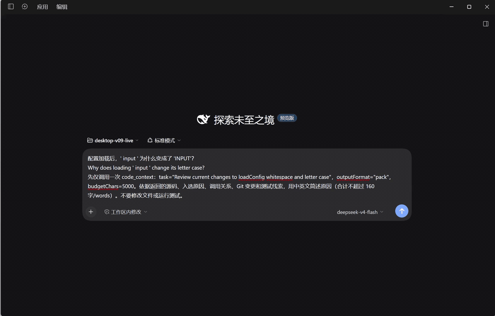
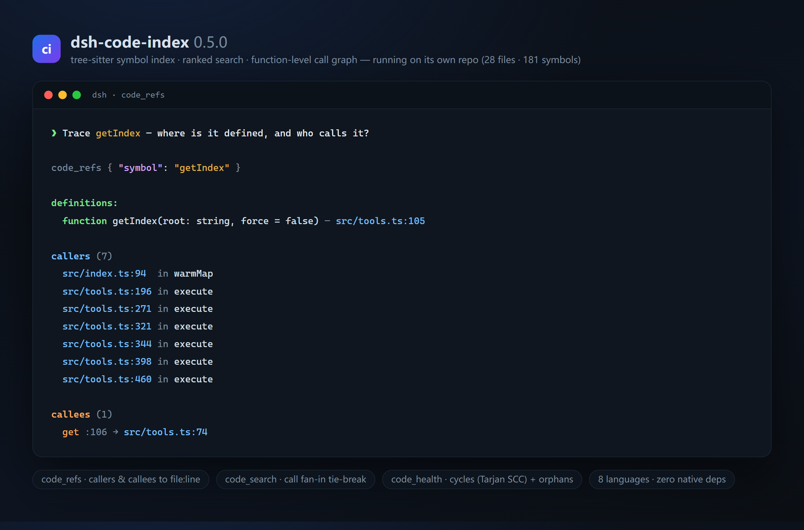

# dsh-code-index

[English](README.md) | 中文

**v0.9.1 — Edit-ready Context Packs**

让 [DeepSeek Harness](https://github.com/deepseek-ai/deepseek-harness) Agent 用一次 `code_context` 调用拿到开始处理任务所需的有界源码上下文：主要声明、强相关 caller/callee、imports、当前变化和相关测试。每个关键 item 都有入选理由，源码有准确行号；证据不足时明确说明缺口。

- **预算内直接给源码：**完整声明 → 整行窗口 → 明确的 signature-only 降级。重叠源码行去重，current/base 分开。
- **唯一最终 pack：**文本与显式 structured output 都基于预算选择后的 ContextPack；默认硬上限 5000 字符。
- **可检查的证据：**入选 reason 与关系的 `exact` / `import-scoped` / `name-only` provenance 分开，不编造概率或 confidence。
- **本地、隔离、实时：**repo/worktree 独立，外部增改删自动刷新，不需要外部索引 API key；保留 full/compact surface 和 v0.8 配置。

v0.9.1 已发布到 npm，修复了 Gitignore 目录白名单规则静默遗漏源码的问题。打包候选产物已通过 DSH Desktop `0.2.0-rc.2` 真实 Agent 验证。验证边界见[release evidence](RELEASE_EVIDENCE_v0.9.1.md)。

## 本页导航

- [🚀 快速开始](#快速开始)
- [🧭 项目隔离与实时更新](#项目隔离与实时更新)
- [👀 实际效果](#实际效果)
- [🧰 工具一览](#工具一览)
- [配置](#配置)
- [支持的语言](#支持的语言)
- [工作原理](#工作原理)
- [已知限制](#已知限制)
- [反馈](#反馈)

## 快速开始

需要 Node 22/24 与匹配的 DSH `0.2.0-rc.2` 宿主版本组。将已发布版本安装到 Web profile：

```sh
npx @deepseek-ai/dsh@0.2.0-rc.2 plugin --profile web add dsh-code-index@0.9.1
npx @deepseek-ai/dsh@0.2.0-rc.2 web
```

本地开发时，在仓库根目录运行 `pnpm install`、`pnpm build`，然后使用 `plugin --profile web add .`。其他 profile 选项见[安装说明](#安装)。

## 项目隔离与实时更新

```text
打开仓库 A → 搜索到 A 的符号
切换到仓库 B → 搜索到 B 的符号,不会混入 A
从 DSH 外部修改文件 → 下一次查询看到变化
切回 A → A 的上下文仍然独立
```

每个 Git worktree 都有独立索引和变更状态。插件会监听会话访问过的项目,并在工具调用时检查文件元数据,因此新增、修改和删除都会自动反映到后续查询,无需手动重建。

## 实际效果

**42 秒真实 DSH 桌面演示：加载 `' input '` 为什么变成了 `'INPUT'`？**



一次真实 `code_context` 调用返回 `src/config.ts:1–3` 的 `loadConfig`、调用方、Git 增改删和相关测试线索，附入选理由与关系来源，共 **2347/5000 字符**。Agent 据此定位到改变大小写的 `.toUpperCase()`。

这是 **2026-10-08 新录制的真实桌面画面**，使用已安装的 v0.9.0 与一个小演示仓库。只展示 DSH，剪去等待并移除音轨；没有修改文件或运行测试，不代表实际耗时，也不宣称修复或测试成功。[MP4 视频](assets/desktop-agent-v090.mp4) · [录制与来源说明](assets/desktop-agent-v090.md) · [实际工具卡片证据](assets/desktop-agent-v090.evidence.json)。

先前的[中英终端回放](assets/agent-context-demo.md)继续保留，单独标明来自 2026-10-05 的真实 Agent 记录，补充展示外部编辑刷新及 500 字符下的签名降级。

可以先试一句：**“用 code_context 定位一个配置加载 Bug，给出相关源码、调用者和可能受影响的测试。”** 欢迎在 [DSH Discussion](https://github.com/deepseek-ai/deepseek-harness/discussions/5623) 分享哪些上下文有帮助、哪些被漏掉。

早期的 [30 秒本地工具演示](assets/context-pack-demo.html) 仍然保留，可用 `pnpm build` 后运行 `node scripts/context-pack-demo.mjs` 复现。Web Context Card 继续延期，Card replay 和文件跳转尚未验证。

## 工具一览

| 工具 | 用途 |
|---|---|
| `code_index` | 查看 / (重)建当前工作区的索引 |
| `code_symbols` | 列出符号(函数、类、接口、类型、方法……),带 file:line——支持按名称、路径、类型、是否导出过滤 |
| `code_search` | 排名检索:精确 > 前缀 > 子串 > 子序列模糊,导出优先,带相关度分数与 file:line |
| `code_map` | 限量排名仓库地图(按符号密度 + import 图 PageRank 取核心文件 + 关键符号与行号) |
| `code_refs` | 沿调用图追踪符号:callers(谁调用了它)与 callees(它调用了谁),解析到 file:line |
| `code_change_context` | 从工作区或显式 diff 出发,返回变更符号、调用者、import 依赖、有限影响路径和可能受影响的测试 |
| `code_context` | Edit-ready ContextPack：有界源码、理由、关系、变化/测试、缺口和硬预算，默认文本返回 |
| `code_health` | 可选开启(`codeHealth: true`):环依赖(import 环)与孤儿模块 |

外加一个可选的**自动注入系统提示词段**(`code-index:repo-map`,序 60):自动选择当前 DSH 会话工作区的精简排名地图。将 `autoInject: false` 可关闭,只依赖 `code_map` 工具。

## 安装

需要 `dsh`(任意安装方式——npx、npm 或源码)与 Node ≥ 22。

当前开发兼容目标为 `@deepseek-ai/dsh@0.2.0-rc.2` / `@deepseek-ai/dsh-tools@0.2.0-rc.2`(CI 覆盖 Node 22 和 24)。DSH 插件接口仍属于预览 API,上游变化可能需要更新兼容适配。

v0.9 要求匹配的 `0.2.0-rc.2` tools runtime；精确 peer pin 防止 npm 新安装选到 registry 中旧的 `latest` 标签。宿主版本组需一起升级；文本、配置、工具 surface 的兼容承诺不等于支持旧 DSH API。

```sh
# 从 npm(预编译)
npx @deepseek-ai/dsh@0.2.0-rc.2 plugin --profile web add dsh-code-index@0.9.0

# 或从包含本仓库检查副本的目录
npx @deepseek-ai/dsh@0.2.0-rc.2 plugin --profile web add ./dsh-code-index
```

重启 Web UI(`npx @deepseek-ai/dsh@0.2.0-rc.2 web`)——启动日志会确认每个工具:

```
[dsh-code-index] plugin loaded
[dsh-code-index] registered tool: code_index
...
```

不启动即可核对组合配置:`dsh --profile web --dump-config`。

## 使用

在工作区会话中,向 agent 提这类请求:

- "我们现在在哪个仓库?先跑 code_map。"
- "找出所有名字含 `parse` 的函数及其位置。"
- "列出 src/core 里的导出符号。"
- "重建代码索引。"
- "工作区改了什么、谁调用了它、哪些测试可能受影响?"
- "修复启动时重复加载配置。"(路由器会自动选择最有用的最小上下文)

*索引*本身不需要 API key;模型当然要配置好才能调用这些工具。

## 更多能力

索引在首次使用时惰性构建;后续调用由磁盘缓存提供,并按 mtime 增量刷新。

### 调用图

`code_refs` 追踪定义、调用者和被调用者。以下是既有工具的较早真实示例，不是 v0.9 Context Card：



### 变更感知上下文

`code_change_context` 默认分析相对于 `HEAD` 的当前 Git 工作区,也支持内联 unified diff、仓库相对 `files` 或稳定的 `symbols` ID。结果有数量和字符预算,每条推导关系都会标注 `exact`、`import-scoped` 或 `name-only` 来源。删除和重命名在可用时读取 baseline;工作区模式也会包含未被忽略的未跟踪源码文件。

### Edit-ready Context Packs

`code_context` 识别修改、符号、架构、测试、探索和模糊任务。用 camel/snake 分词及文件名、路径、签名 terms 做确定性候选排序，保留 exact symbol；从强 primary seed 找 clean-tree likely tests，图邻域有界。不使用 BM25。

`budgetChars` 默认 5000，规范化到 300–20000；`maxFiles` 默认 12，`maxSymbols` 默认 10。预算按 JavaScript 字符串字符计，不是 token 或 UTF-8 字节。文本和最终 pack 的 JSON 都必须满足上限，不切断代码行。小预算可能只剩签名或缺口；仓库身份本身无法放入预算时返回明确错误。展示任务摘要最多 120 字符，不影响路由。

默认 canonical return 保持 **string**。显式传 `outputFormat: "pack"` 才返回导出的 `ContextPack` DTO。`items` 已经过预算选择，源码字段为 `file/startLine/endLine/side/ref/mode/code`，同时有 `reason` 及适用的独立关系 `resolution/provenance`。`budget.usedChars` 对应文本，`budget.packChars` 对应 JSON；用 `renderContextPack` 渲染，不暴露隐藏候选列表。

Git 变化使用固定的 baseline commit 判定 added/modified/deleted，保留可靠文件 rename。结构身份不明确或 baseline 缺失时为 `unclassified`，不猜 symbol rename。`code_change_context` 的显式 `files`/`symbols` 仍是选择模式，不构成 Git modified 的证据。

## 配置

选项通过插件行的 `config` 在 profile 补丁中传入(缺省时使用默认值):

```yaml
# $DSH_HOME/profiles/<name>/cordis.patch.yml —— 裸行按 id 覆盖。
- id: code-index
  config:
    excludeDirs: [generated, playground]
    mapTopFiles: 30
    mapMaxChars: 4000
    autoInject: true
    toolSurface: full
```

| 键 | 默认 | 含义 |
|---|---|---|
| `excludeDirs` | `[]` | 追加到内置排除列表的目录名,按路径组件精确匹配;不支持 `secrets/**` 这类 glob |
| `mapTopFiles` | `24` | 排名地图中的最大文件数 |
| `mapMaxChars` | `3200` | 渲染地图的硬性字符上限 |
| `mapTtlMs` | `60000` | 自动注入地图的刷新间隔(毫秒,最小 1000) |
| `autoInject` | `true` | 是否注册系统提示词段 |
| `codeHealth` | `false` | 是否注册 `code_health` 工具(环/孤儿模块) |
| `toolSurface` | `full` | 实验性的 `compact` 模式只暴露 `code_index`、`code_context` 和已启用的 `code_health`; `full` 保持全部工具 |
| `externalWatch` | `true` | 监听当前活动项目的外部源码变更 |
| `watchDebounceMs` | `120` | 合并文件事件后再刷新受影响文件(最小 20 毫秒) |

## 支持的语言

TypeScript、JavaScript、Python、Go、Rust、Java、C++、C(`.ts .tsx .mts .cts .js .jsx .mjs .cjs .py .pyi .go .rs .java .cpp .cc .cxx .c++ .hpp .hxx .hh .h .ipp .tpp .inl .c`),通过 tree-sitter WASM 解析——纯解析,无需原生编译。符号提供方的接缝(`src/extract.ts` + 语法文件)预留了后续接入其他语言/嵌入检索的位置。C/C++ 符号提取通过 declarator 链解析名字(模板、`ns::name` 限定定义、类内方法),`#include "…"` 会接入 repo map 的引用图。

## 工作原理

- **索引构建**(`src/buildIndex.ts`):递归扫描(应用排除规则),逐文件 tree-sitter 提取(`src/extract.ts`),JSON 缓存置于 `<repo>/.dsh-code-index/`,按 mtime 增量刷新(只有被改动的文件才重新解析)。
- **搜索**(`src/search.ts`):纯打分——精确 `1` / 前缀 `0.8` / 子串 `0.5`,导出加权,名称序平局裁决。
- **仓库地图**(`src/repomap.ts`):import 图上的个性化 PageRank(传送向量 = 各文件密度份额,被其他枢纽文件引用的枢纽会比平铺入度统计排得更靠前),以密度感知的文件打分为底(class/interface/function 加权,测试路径衰减),取 Top-N 文件,每文件符号上限,硬截断。
- **调用图**(`src/refgraph.ts`):逐文件提取调用点(按语言,并记录其所属函数),按名称解析成 callers 与 callees——`code_refs` 直接暴露,`code_search` 也把调用热度作为排名平局裁决。
- **变更上下文**(`src/change-context.ts`):把 Git hunk 映射到稳定符号,再在有限深度内追踪带来源标签的调用者、import 依赖、入口路径、影响范围和可能受影响的测试,避免返回整个仓库。
- **ContextPack**(`src/context.ts`、`src/context-pack.ts`、`src/source-excerpts.ts`)：候选排序、临时读取源码证据、按文本/JSON 预算选择唯一 DTO，再渲染入选项。
- **健康检查**(`src/health.ts`):对 import 图跑 Tarjan SCC 得到环依赖;孤儿模块检测列出既不被 import、也不 import 任何文件的含符号文件(排除入口与测试)。
- **工作区解析**:每个工具解析会话 cwd(`agent.session.header.cwd`)并向上查找最近的 `.git`(有界——没有仓库标记的目录绝不会被索引)。
- **项目上下文**(`src/repo-context.ts`):用真实规范路径区分各 worktree,最多保留四个上下文。每次工具调用扫描文件元数据并只重解析变化文件;watcher 会在有限 debounce 后刷新脏文件。
- **忽略规则**:索引遵守仓库根目录及嵌套 `.gitignore`;`excludeDirs` 仍是精确目录名列表,不支持 glob。

## 已知限制

- **web-tree-sitter 固定为 `^0.25`(ESM)** —— 0.25 采用 ESM 具名导出(`Language`/`Query`);与 `tree-sitter-wasms` 静态构建的组合在 Node ≥ 22/24 下验证可用。
- 自动注入地图使用 DSH system prompt assembly 提供的当前会话上下文。没有 Agent 的 prompt assembly 会回退到 DSH 进程工作目录。新访问的项目第一次注入可能暂时为空,待索引完成后后续 assembly 会使用项目地图。
- Watcher 只为工具实际访问的项目启动,并随插件卸载清理。设置 `externalWatch: false` 后,每次工具调用仍会扫描元数据以发现常规 mtime 变化。
- 大型 monorepo 每次工具调用仍需要扫描目录元数据。文件解析是增量的,但扫描耗时取决于仓库规模和磁盘速度。
- 不索引函数局部变量；索引模块声明和类成员，parser/graph 不等同于 type checker。
- current 源码读取会拒绝索引快照后发生变化、真实路径越出 root 或超过 1 MB 的文件；signature-only 和 gaps 标明缺失证据。Likely tests 是线索，不保证覆盖。

## 开发

```sh
pnpm install
pnpm test        # vitest —— 提取器、扫描、缓存、搜索、仓库地图、调用图、健康检查
pnpm typecheck
pnpm build       # tsup → dist/index.js(ESM,外部依赖)
pnpm build && pnpm release:smoke # 打包、干净安装 tarball、启动插件并调用核心工具
```

`bench/` 下的 benchmark 对比 stock DSH、已发布的 0.5 基线、0.6 变更感知处理组和 0.7 任务感知处理组,记录任务完成、输入 token、工具调用、轮次和墙钟时间; provider 未提供的 usage 会保留为 null,不会伪造性能数据。当前仓库提供基础设施和示例任务,不宣称已测得性能提升。

**WSL → Windows 检出**:从 WSL 对 `/mnt/c` 下的检出跑 `pnpm install`,会留下 Windows 侧 Node 无法穿透的 Linux 风格符号链接(`Cannot find package 'web-tree-sitter'`、`EACCES`)。无需重装,在 Windows 侧跑一次修复:

```sh
node.exe scripts\fix-wsl-links.mjs            # 本仓库的 node_modules
node.exe scripts\fix-wsl-links.mjs C:\Users\you\.dsh\profiles\web   # dsh profile 里的插件安装
```

它会把每个失效链接以 junction 形式重新指向 `.pnpm` store 里的真实位置;可重复执行(幂等,干净时报 `fixed: 0`)。

## 反馈

用过 dsh-code-index？欢迎告诉我哪些地方有帮助、哪里出错，或缺少了什么上下文。可以回复[DSH 官方插件介绍讨论](https://github.com/deepseek-ai/deepseek-harness/discussions/5623)；如果仓库允许创建 Issue，也可以使用[反馈 Issue 表单](https://github.com/lemonxiny55/dsh-code-index/issues/new?template=feedback.yml)。

为了方便复现，请尽量说明仓库的大致规模和语言、执行的任务、预期上下文与 Agent 实际收到的内容，以及是否涉及项目切换、worktree 或外部文件修改。请勿粘贴私有源码、凭据或 API key。

## 许可证

MIT。与 DeepSeek 无关;基于公开的 `dsh` 插件接口构建。

